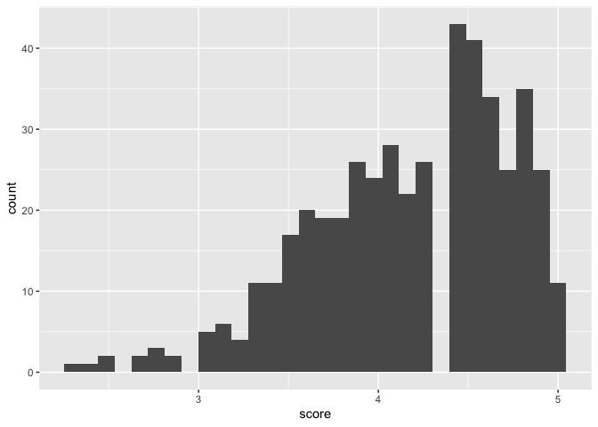
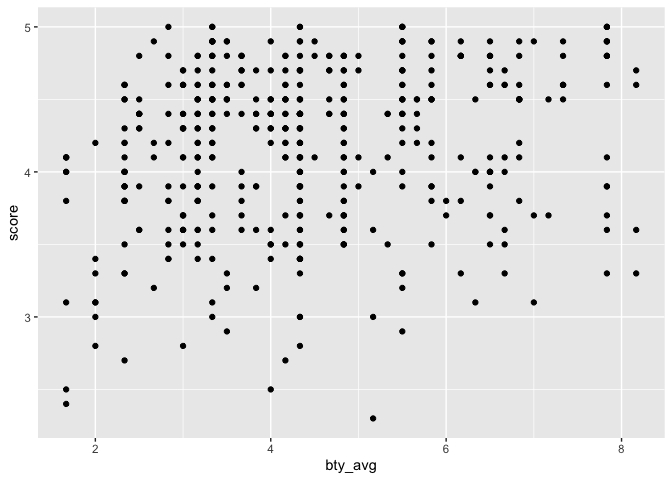
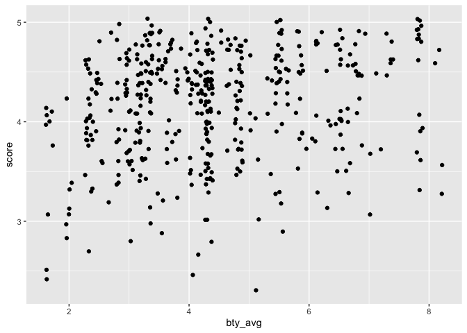
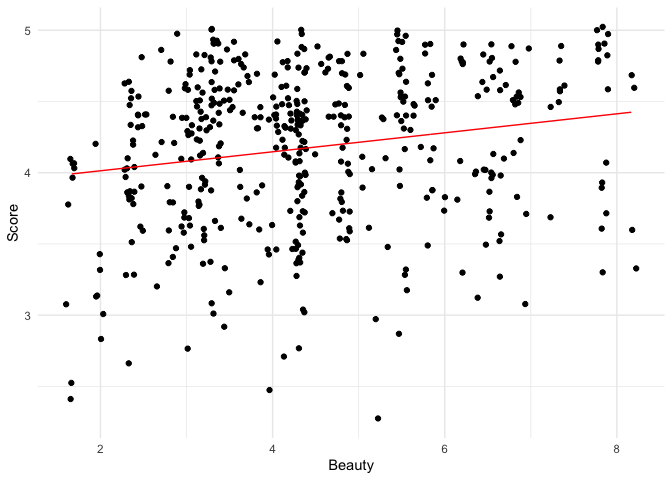

Lab 10 - Grading the professor
================
Thomas Huang
2026-03-26

Here is a link to the [lab
instructions](https://datascience4psych.github.io/DataScience4Psych/lab10.html).

## Load Packages and Data

``` r
library(tidyverse) 
library(tidymodels)
library(openintro)

data(evals)
?evals
```

# Part 1

## Exercise 1

By looking at the histogram and the descriptives, the distirbution is
left skewed. In general, the students are generous.

``` r
psych::describe(evals$score)
```

    ##    vars   n mean   sd median trimmed  mad min max range skew kurtosis   se
    ## X1    1 463 4.17 0.54    4.3    4.22 0.59 2.3   5   2.7 -0.7     0.04 0.03

``` r
ggplot(evals, aes(x = score)) +
  geom_histogram()
```

    ## `stat_bin()` using `bins = 30`. Pick better value `binwidth`.

<!-- -->

## Exercise 2

It seems that there is a positive relationship between the two
variables. But there is also a lot of noise.

``` r
ggplot(evals, aes(x = bty_avg, y = score)) +
  geom_point()
```

<!-- -->

## Exercise 3

This function fixes stacked or overlapped observations, which gives a
better visualization of number of observations, density of observations,
and noise. One might be mislead by the last plot because it fails to
visualize lots of noise in the data.

``` r
ggplot(evals, aes(x = bty_avg, y = score)) +
  geom_jitter()
```

<!-- -->

# Part 2

## Exercise 1

Fitted regression equation: $$\hat{y} = 3.88034 + 0.06664x$$

This equation suggests that a one-point increase in beauty predicts a
0.06664-point increase in course evaluation.

``` r
m_bty <- lm(evals$score ~ evals$bty_avg)
summary(m_bty)
```

    ## 
    ## Call:
    ## lm(formula = evals$score ~ evals$bty_avg)
    ## 
    ## Residuals:
    ##     Min      1Q  Median      3Q     Max 
    ## -1.9246 -0.3690  0.1420  0.3977  0.9309 
    ## 
    ## Coefficients:
    ##               Estimate Std. Error t value Pr(>|t|)    
    ## (Intercept)    3.88034    0.07614   50.96  < 2e-16 ***
    ## evals$bty_avg  0.06664    0.01629    4.09 5.08e-05 ***
    ## ---
    ## Signif. codes:  0 '***' 0.001 '**' 0.01 '*' 0.05 '.' 0.1 ' ' 1
    ## 
    ## Residual standard error: 0.5348 on 461 degrees of freedom
    ## Multiple R-squared:  0.03502,    Adjusted R-squared:  0.03293 
    ## F-statistic: 16.73 on 1 and 461 DF,  p-value: 5.083e-05

## Exercise 2

``` r
# Visualize the regression lines
evals$score_p <- predict(m_bty, newdata = evals)

ggplot(evals, aes(x = bty_avg, y = score)) +
  geom_jitter() +
  geom_line(aes(y = score_p), color = "red") + 
  labs(x = "Beauty", y = "Score") +
  theme_minimal()
```

<!-- -->

## Exercise 3

The scores do not much with beauty ratings. That is, a one-point
increase in beauty predicts a 0.06664-point increase in course
evaluation scores.

The intercept represents the avergae course evaluation scores of
professors with a beauty rating of zero. It is more of a mathematical
artifact in this case because beauty is rated on a scale from 1 to 10.
Nobody will get a zero in beauty ratings. The meaningful minimum of
beauty rating is 1.

The $R^2$ is .035. This indicates beauty ratings explain 3.5% of the
variance in course evaluation scores. This is a minor piece of the
story.

I assume there will be a lot of uncertainty around the line. At this
stage, the substaintial shade may couse the confusion that the model is
strong and certain.

# Part 3

## Exercise 1

The reference level is female. The mean difference in evaluation scores
indicates that the mean score male professor is 0.142 point higher than
that of female professors.

``` r
m_gen <- lm(score ~ gender, data = evals)
tidy(m_gen)
```

    ## # A tibble: 2 × 5
    ##   term        estimate std.error statistic p.value
    ##   <chr>          <dbl>     <dbl>     <dbl>   <dbl>
    ## 1 (Intercept)    4.09     0.0387    106.   0      
    ## 2 gendermale     0.142    0.0508      2.78 0.00558

``` r
evals$rank_relevel <- relevel(evals$rank, ref = "tenure track")
evals$tenure_eligible <- ifelse(evals$rank == "teaching", "no", "yes")
```

## Exercise 2

``` r
m_rank <- lm(score ~ rank, data = evals)
m_relevel <- lm(score ~ rank_relevel, data = evals)
m_tenure <- lm(score ~ tenure_eligible, data = evals)
```

## Exercise 3

Teaching faculty receives higher scores. Tenured faculty receoives lower
scores.

``` r
summary(m_rank)
```

    ## 
    ## Call:
    ## lm(formula = score ~ rank, data = evals)
    ## 
    ## Residuals:
    ##     Min      1Q  Median      3Q     Max 
    ## -1.8546 -0.3391  0.1157  0.4305  0.8609 
    ## 
    ## Coefficients:
    ##                  Estimate Std. Error t value Pr(>|t|)    
    ## (Intercept)       4.28431    0.05365  79.853   <2e-16 ***
    ## ranktenure track -0.12968    0.07482  -1.733   0.0837 .  
    ## ranktenured      -0.14518    0.06355  -2.284   0.0228 *  
    ## ---
    ## Signif. codes:  0 '***' 0.001 '**' 0.01 '*' 0.05 '.' 0.1 ' ' 1
    ## 
    ## Residual standard error: 0.5419 on 460 degrees of freedom
    ## Multiple R-squared:  0.01163,    Adjusted R-squared:  0.007332 
    ## F-statistic: 2.706 on 2 and 460 DF,  p-value: 0.06786

``` r
summary(m_relevel)
```

    ## 
    ## Call:
    ## lm(formula = score ~ rank_relevel, data = evals)
    ## 
    ## Residuals:
    ##     Min      1Q  Median      3Q     Max 
    ## -1.8546 -0.3391  0.1157  0.4305  0.8609 
    ## 
    ## Coefficients:
    ##                      Estimate Std. Error t value Pr(>|t|)    
    ## (Intercept)           4.15463    0.05214  79.680   <2e-16 ***
    ## rank_relevelteaching  0.12968    0.07482   1.733   0.0837 .  
    ## rank_releveltenured  -0.01550    0.06228  -0.249   0.8036    
    ## ---
    ## Signif. codes:  0 '***' 0.001 '**' 0.01 '*' 0.05 '.' 0.1 ' ' 1
    ## 
    ## Residual standard error: 0.5419 on 460 degrees of freedom
    ## Multiple R-squared:  0.01163,    Adjusted R-squared:  0.007332 
    ## F-statistic: 2.706 on 2 and 460 DF,  p-value: 0.06786

``` r
summary(m_tenure)
```

    ## 
    ## Call:
    ## lm(formula = score ~ tenure_eligible, data = evals)
    ## 
    ## Residuals:
    ##     Min      1Q  Median      3Q     Max 
    ## -1.8438 -0.3438  0.1157  0.4360  0.8562 
    ## 
    ## Coefficients:
    ##                    Estimate Std. Error t value Pr(>|t|)    
    ## (Intercept)          4.2843     0.0536  79.934   <2e-16 ***
    ## tenure_eligibleyes  -0.1406     0.0607  -2.315    0.021 *  
    ## ---
    ## Signif. codes:  0 '***' 0.001 '**' 0.01 '*' 0.05 '.' 0.1 ' ' 1
    ## 
    ## Residual standard error: 0.5413 on 461 degrees of freedom
    ## Multiple R-squared:  0.0115, Adjusted R-squared:  0.009352 
    ## F-statistic: 5.361 on 1 and 461 DF,  p-value: 0.02103

## Exercise 4

The $R^2$’s are .012, .012, and .012. Rank does not explain much.

# Part 4

``` r
m_bty_gen <- lm(score ~ bty_avg + gender, data = evals)
summary(m_bty_gen)
```

    ## 
    ## Call:
    ## lm(formula = score ~ bty_avg + gender, data = evals)
    ## 
    ## Residuals:
    ##     Min      1Q  Median      3Q     Max 
    ## -1.8305 -0.3625  0.1055  0.4213  0.9314 
    ## 
    ## Coefficients:
    ##             Estimate Std. Error t value Pr(>|t|)    
    ## (Intercept)  3.74734    0.08466  44.266  < 2e-16 ***
    ## bty_avg      0.07416    0.01625   4.563 6.48e-06 ***
    ## gendermale   0.17239    0.05022   3.433 0.000652 ***
    ## ---
    ## Signif. codes:  0 '***' 0.001 '**' 0.01 '*' 0.05 '.' 0.1 ' ' 1
    ## 
    ## Residual standard error: 0.5287 on 460 degrees of freedom
    ## Multiple R-squared:  0.05912,    Adjusted R-squared:  0.05503 
    ## F-statistic: 14.45 on 2 and 460 DF,  p-value: 8.177e-07

## Exercise 1

The beauty slope has increased, or become larger in value.

## Exercise 2

The gender slope is still statistically significant. So, yes.

## Exercise 3

The adjusted $R^2$ is .055. Having gender in the model is helpful.

## Exercise 4

Within the same rank of faculty, a one-point increase in beauty rating
predicts a 0.68-point increase in course evaluation score. Holding
beauty rating constant, tenure-track and tenured faculty have lower
course evaluation compared to teaching faculty.

``` r
m_bty_rank <- lm(score ~ bty_avg + rank, data = evals)
summary(m_bty_rank)
```

    ## 
    ## Call:
    ## lm(formula = score ~ bty_avg + rank, data = evals)
    ## 
    ## Residuals:
    ##     Min      1Q  Median      3Q     Max 
    ## -1.8713 -0.3642  0.1489  0.4103  0.9525 
    ## 
    ## Coefficients:
    ##                  Estimate Std. Error t value Pr(>|t|)    
    ## (Intercept)       3.98155    0.09078  43.860  < 2e-16 ***
    ## bty_avg           0.06783    0.01655   4.098 4.92e-05 ***
    ## ranktenure track -0.16070    0.07395  -2.173   0.0303 *  
    ## ranktenured      -0.12623    0.06266  -2.014   0.0445 *  
    ## ---
    ## Signif. codes:  0 '***' 0.001 '**' 0.01 '*' 0.05 '.' 0.1 ' ' 1
    ## 
    ## Residual standard error: 0.5328 on 459 degrees of freedom
    ## Multiple R-squared:  0.04652,    Adjusted R-squared:  0.04029 
    ## F-statistic: 7.465 on 3 and 459 DF,  p-value: 6.88e-05

# Part 5

## Hint

For Exercise 12, the `relevel()` function can be helpful!
